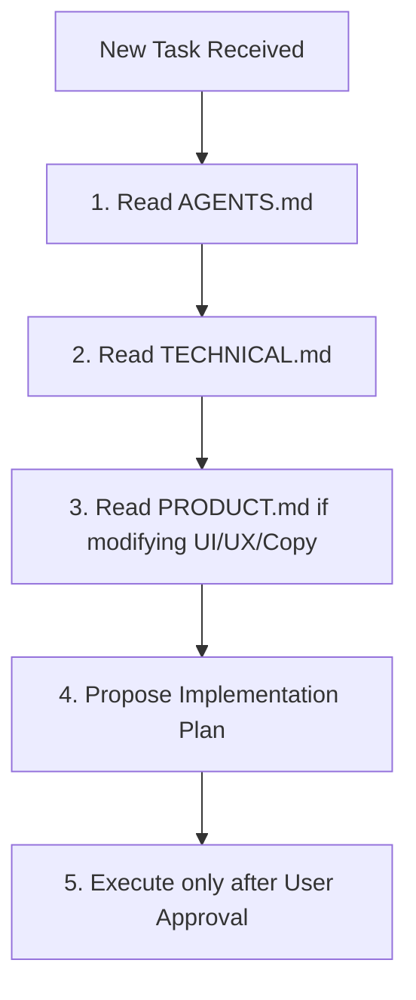

# Tunerly - AI Agent Integration & Development Guide

This document defines the rules, behavior constraints, and technical directives for AI coding agents modifying the **Tunerly** codebase. Reading and following these rules is mandatory before submitting any code edits or proposing plans.

---

## 1. Core Operating Directive

As an AI coding assistant, you must act as a Senior Software Architect and Engineering Lead. Prioritize **maintainability, architecture consistency, and type safety** above execution speed. Never cut corners.

---

## 2. Onboarding Workflow for AI Agents

When initialized or starting a new programming task on Tunerly, you must execute the following workflow:

1. **Read `AGENTS.md` first:** Understand your constraints and boundaries.
2. **Read `TECHNICAL.md` second:** Understand the software architecture, DSP audio pipeline, and coding conventions.
3. **Read `PRODUCT.md` third:** If your task modifies UI layouts, typography, color palettes, spacing, or copywriting.
4. **Draft the Implementation Plan:** Outline the target files and structural changes. Do not write code until the user approves the plan.

---

## 3. Strict Development Rules

### Rule 1: Respect Clean Architecture Boundaries
- Business logic, math, and filter code must live in `src/core/` (pure TypeScript modules) or custom React hooks.
- **Never** write DSP filtering, frequency smoothing, cents differences, or MIDI conversions directly inside React view components.
- React components must remain declarative, styling-focused, and stateless where possible.

### Rule 2: Keep Strict Type Safety (No `any`)
- All code must be strictly typed.
- Do not use `any` or `ts-ignore` to suppress compilation warnings in application code. Resort to `ts-ignore` only in mock scripts or test suites when Node/browser environment types conflict.
- Explicitly typecast variables and return values.

### Rule 3: Do Not Introduce Unjustified Dependencies
- Do not install npm packages or external libraries unless explicitly approved.
- Tunerly relies on high-performance custom implementations for responsive layout (`useResponsive`), DSP filters (`InstrumentBandpassFilter`), and smoothing (`PitchFilter`). Leverage existing services instead of downloading libraries.

### Rule 4: Clean Up Unused Imports & Variables
- After completing edits, run `npm run lint` and `npx tsc --noEmit`.
- Ensure all warnings about unused variables, imports, or syntax inconsistencies are addressed. Code with warnings is unacceptable.

### Rule 5: Keep the Brand Voice Clean and Minimal
- If modifying button text, alerts, logs, or user-facing messages, verify against the Copywriting Guidelines in [PRODUCT.md](PRODUCT.md).
- Keep text brief, technical, and professional. Avoid exclamation marks, emojis, or platform-bloat encouragement.

### Rule 6: Document Architectural Deviations
- If a change deviates from the established patterns (e.g. state flow, audio loops), you must document it in an Architecture Decision Record (ADR) under `docs/decisions/` and update the roadmap in `docs/architecture/roadmap.md`.
