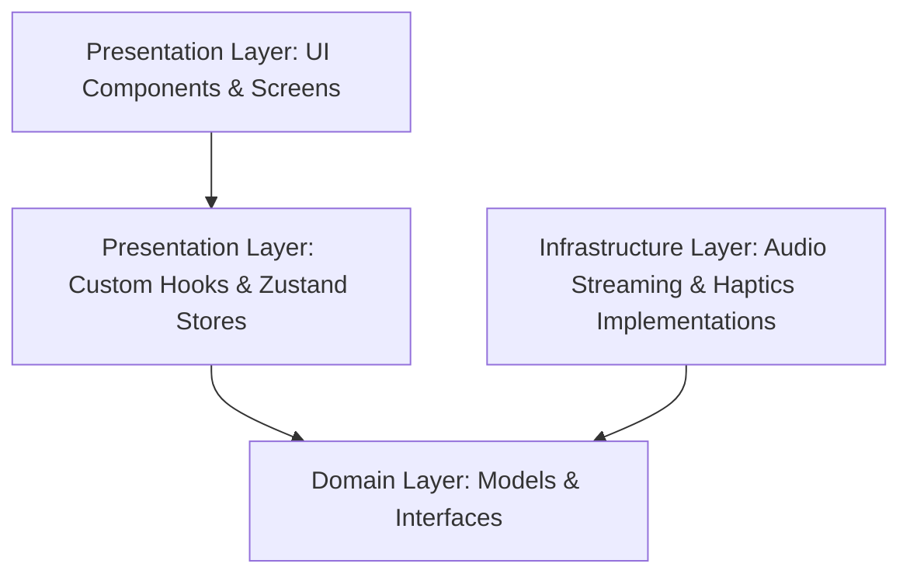
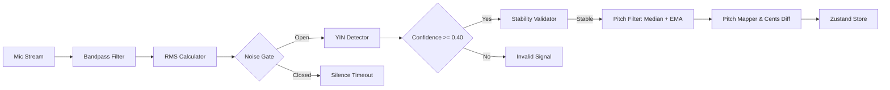

# Tunerly - Technical Specification (The Engineering Bible)

This document defines the technical architecture, development standards, coding conventions, and pipeline specifications for **Tunerly**. It is the primary reference for software engineers and AI coding agents.

---

## 1. Architectural Architecture & Core Design Patterns

Tunerly is built using **Clean Architecture** to enforce separation of concerns, facilitate unit testing, and isolate critical audio digital signal processing (DSP) logic from the UI framework.

### Architectural Layers

1. **Presentation Layer (`src/features/*/presentation/`):**
   - **UI Views:** Stateless visual components rendering theme styles.
   - **Custom Hooks:** Custom hooks orchestrating state updates, haptics, and system events.
   - **Global Stores:** Zustand stores holding the application's interactive state.
2. **Domain Layer (`src/features/*/domain/` & `src/core/*/domain/`):**
   - **Entities / Models:** Clean TypeScript interfaces representing domain structures (e.g., `StringNote`, `Tuning`, `Instrument`).
   - **Interfaces:** Abstract contracts defining infrastructure capabilities (e.g., `IAudioRecorder`).
3. **Infrastructure Layer (`src/core/*/infrastructure/`):**
   - Concrete implementations of domain interfaces (e.g., `WebAudioRecorder` utilizing device microphones, `SimulatedAudioRecorder` for simulator testing).

### Core Development Principles
* **SOLID:** Enforce Single Responsibility (isolate DSP filters), Open/Closed (add new instruments via config instead of rewriting code), Liskov Substitution, Interface Segregation, and Dependency Inversion.
* **DRY (Don't Repeat Yourself):** Reuse utility calculations (e.g., Cents formulas).
* **KISS (Keep It Simple, Stupid):** Avoid pre-emptively introducing complex frameworks or audio libraries.
* **YAGNI (You Aren't Gonna Need It):** Limit features strictly to the active roadmap phase.

---

## 2. Audio Processing Pipeline & DSP Flow

The audio pipeline runs continuously inside a low-level PCM stream callback on a dedicated thread, transferring results to the presentation state.

### Pipeline Components

1. **Audio Capture:** Raw Float32Array PCM chunks streamed from the microphone at 44100Hz.
2. **Bandpass Filter (`InstrumentBandpassFilter`):** A 2-pole IIR high-pass and low-pass filter configured dynamically based on the frequency range of the active instrument to reject out-of-band harmonics and noise.
3. **Noise Gate (`NoiseGate`):** Computes the Root Mean Square (RMS) amplitude of the filtered buffer. If the RMS is below the active threshold, the signal is rejected immediately.
4. **Pitch Detection (`YinDetector`):** Employs the YIN autocorrelation algorithm to extract the fundamental frequency ($f_0$) and confidence value.
5. **Stability Validator (`SignalValidator`):** Tracks a rolling history of 6 frames. The frequency is marked stable only if the standard deviation is less than 2%.
6. **Pitch Filter (`PitchFilter`):** 
   - Applies a median filter (window size 5) to reject outlier spikes.
   - Applies an Exponential Moving Average (EMA) with $\alpha = 0.15$ to stabilize the visual needle gauge.
   - Snaps/resets instantly if a frequency jump greater than 5% persists for 2 frames (indicating a different string pluck).
7. **Pitch Mapper (`PitchProcessor`):** Converts frequency to MIDI note numbers, matches the closest target tuning note, and computes cents deviation.

---

## 3. Responsive Design System (`useResponsive`)

Tunerly avoids hardcoded layout dimensions in favor of a dynamic hook: [useResponsive](file:///home/drawilet/projects/tunerly/src/hooks/useResponsive.ts).

### Screen Classifications

Six named breakpoints (all widths in CSS device-independent pixels):

| Breakpoint | Width range | Alias flag |
|---|---|---|
| `compactMobile` | < 360 | `isCompact` |
| `regularMobile` | 360–599 | `isRegular` |
| `tablet` | 600–1023 | `isTablet` |
| `laptop` | 1024–1279 | `isLaptop` |
| `desktop` | 1280–1535 | `isDesktop` |
| `largeDesktop` | ≥ 1536 | `isLargeDesktop` |

`isDesktop` is `true` for both `desktop` and `largeDesktop` to remain backward-compatible with existing consumers.

`isWideLayout` is `true` for tablet and above — use it to enable max-width centering.

### System Tokens Exposed
- `spacing`: Continuous spacing dictionary (`xs`–`xxl`) interpolated linearly from mobile (390 px) to desktop (1440 px) anchors. Values grow smoothly instead of snapping.
- `fontScale`: Continuous font-size multiplier (1.0 at 390 px → 1.5 at 1536 px).
- `tunerScale`: Continuous proportional scale factor (0.85 at 320 px → 2.0 cap at large widths). Drives `TunerDisplay` sizing independently per-dimension via `scaleDim(ref, tunerScale, min, max)`.
- `contentMaxWidth`: Maximum content width per breakpoint tier (600 → 1400 px).
- `insets`: Safe area boundaries to prevent notch and home indicator clipping.

### Zoom Stability
Components must not re-subtract parent padding from `width` when computing child widths (double-subtraction). Use `width: '100%'` with `maxWidth` caps instead.  The `global.css` sets `box-sizing: border-box`, `overflow-x: hidden`, and `font-size: 100%` to ensure the browser's zoom scaling is respected rather than overridden.

---

## 4. Coding Conventions & Standards

### Naming Conventions
- **Files:** PascalCase for React components (`TunerDisplay.tsx`), camelCase for hooks and services (`useResponsive.ts`, `yin.ts`).
- **Interfaces & Types:** PascalCase. Prefix interfaces with `I` only for abstract core classes (`IAudioRecorder`).
- **Variables & Functions:** camelCase.
- **Constants:** UPPER_SNAKE_CASE (`SUPPORTED_INSTRUMENTS`).

### Component Guidelines
- Use Functional Components with TypeScript typings (`React.ReactNode`).
- Keep components small and focused. Business logic, state manipulation, and calculations must live in hooks/stores.
- Extract complex styles to a static `StyleSheet.create` block, referencing dynamic tokens inline only when responsive sizes require it.

---

## 5. Performance, Accessability & Security

### Performance
- Maintain **60 FPS** animations for the tuner needle using native thread drivers in React Native Reanimated.
- Wrap heavy callback dependencies in `useCallback` and memoize static visual elements.
- Never write console logs inside the 44100Hz audio stream thread callback.

### Accessibility
- Provide comfortable touch targets (minimum **44px** height and width).
- Ensure high color contrast ratios for dark-mode text.
- Support text scaling dynamically via the `fontScale` modifier.

### Security
- Audio input is processed entirely in volatile memory on the local device CPU.
- Tunerly does not record, persist, or transmit raw microphone streams, complying fully with data privacy frameworks.
- No network permissions are utilized for core tuning.
